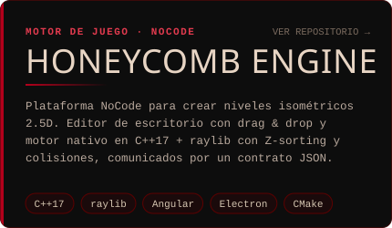
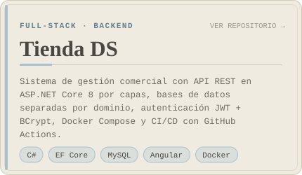
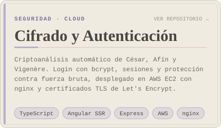
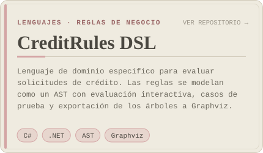
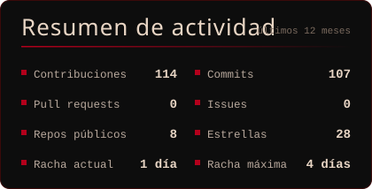
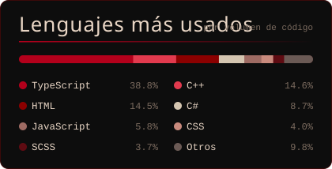
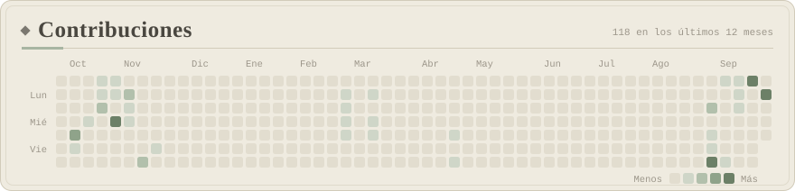
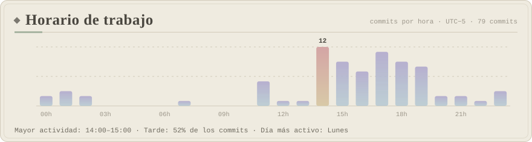
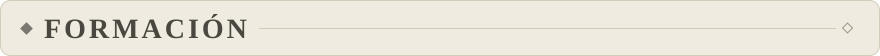

  

  
  
  

 

Soy estudiante de **Ingeniería de Sistemas** en la Universidad El Bosque y construyo software **escalable, eficiente y bien organizado**. He desarrollado APIs REST desplegadas en contenedores, un motor de juego nativo en C++ y aplicaciones con autenticación segura desplegadas en la nube con TLS.

- **Objetivo:** práctica profesional en desarrollo backend, full-stack o seguridad de la información.
- **Intereses:** arquitectura de software, sistemas embebidos, visión artificial, aviónica y sistemas médicos.
- **Forma de trabajo:** documento lo que construyo, separo responsabilidades por capas y dejo cada proyecto listo para ejecutarse y probarse.

 
 

  
  

  
  

| Proyecto | Descripción | Stack |
| :--- | :--- | :--- |
| [Tienda DS (versión monolítica)](https://github.com/Semiramyz/Tienda-DS) | Primera versión del sistema de gestión comercial, base de la arquitectura actual. | C# · ASP.NET Core · Angular |
| [Calculadora IP](https://github.com/Semiramyz/Redes-Maquina-Virtual-PIN) | Red, broadcast, rango de hosts, clase y tipo de IP con representación binaria. | PHP |
| [Ordenamiento de matrices](https://github.com/Semiramyz/ordenamiento_matrices) | Bubble, Selection, Insertion, Merge y Quick Sort con arquitectura MVC e interfaz gráfica. | Java |
| Detección de personas en ESP32 | Visión artificial en sistema embebido con interfaz web integrada. | C++ · TensorFlow Lite · ESP32-CAM |

 

  
  

  

  

Métricas generadas automáticamente cada día con GitHub Actions a partir de la API de GitHub.

 

<b>Lenguajes</b>

  

<b>Frameworks</b>

  

<b>Bases de datos, DevOps y herramientas</b>

  

 

**Ingeniería de Sistemas** · Universidad El Bosque, Colombia
<!-- Opcional: agrega tu semestre actual y fecha esperada de grado -->

 

Estoy disponible para **práctica profesional**. Si mi perfil encaja con su equipo, con gusto conversamos.

  
  
  

